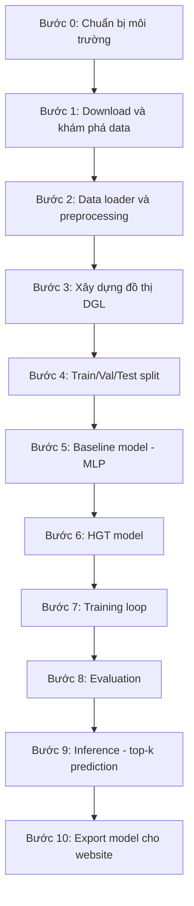
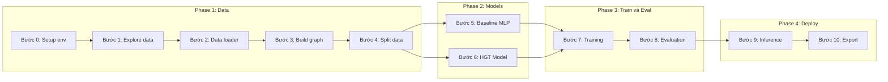

# Kế hoạch tổng thể: Xây dựng AI Model dự đoán liên kết Thuốc–Bệnh

## Mục tiêu cuối cùng
Xây dựng hệ thống website cho phép:
- Nhập tên thuốc hoặc bệnh → dự đoán mối liên kết thuốc–bệnh
- Hiển thị top-k kết quả với score
- Lưu lịch sử tra cứu
- Quản lý dữ liệu thuốc, bệnh, kết quả dự đoán

**Ưu tiên hiện tại: Hoàn thiện AI model trước, website sau.**

---

## PHẦN A: HIỂU BÀI TOÁN TỪ ĐẦU

### A1. Bài toán là gì?

Hãy tưởng tượng bạn có:
- Một danh sách **thuốc** (ví dụ: Aspirin, Metformin, ...)
- Một danh sách **bệnh** (ví dụ: Tiểu đường, Ung thư phổi, ...)
- Một danh sách **protein** (các phân tử sinh học trung gian)

Giữa chúng có các **mối quan hệ đã biết**:
- Thuốc A tác động lên Protein X
- Protein X liên quan đến Bệnh Y
- Thuốc A đã được xác nhận chữa Bệnh Z

**Câu hỏi**: Thuốc A có thể chữa thêm bệnh nào khác mà ta chưa biết?

Đây gọi là **drug repositioning** — tìm công dụng mới cho thuốc cũ. Rất có giá trị vì phát triển thuốc mới tốn hàng tỷ đô.

### A2. Tại sao dùng đồ thị?

Dữ liệu này tự nhiên có dạng **đồ thị** (graph):
- **Nút** (node) = thuốc, protein, bệnh
- **Cạnh** (edge) = mối quan hệ giữa chúng

```
  [Thuốc A] ---tác động---> [Protein X] ---liên quan---> [Bệnh Y]
      |                                                      ^
      +------------------đã biết chữa-----------------------+
```

### A3. Đồ thị dị thể là gì?

Đồ thị thông thường: tất cả nút giống nhau.
**Đồ thị dị thể** (heterogeneous graph): có **nhiều loại nút** và **nhiều loại cạnh**.

Trong dự án này:
- 3 loại nút: `Drug`, `Protein`, `Disease`
- 6 loại cạnh:
  - `drug → protein` (thuốc tác động lên protein)
  - `protein → drug` (chiều ngược)
  - `protein → disease` (protein liên quan bệnh)
  - `disease → protein` (chiều ngược)
  - `drug → disease` (thuốc chữa bệnh — đây là cạnh ta muốn dự đoán)
  - `disease → drug` (chiều ngược)

### A4. HGT là gì?

**HGT = Heterogeneous Graph Transformer**

Chia nhỏ từng phần:
1. **Graph Neural Network (GNN)**: mạng nơ-ron hoạt động trên đồ thị. Mỗi nút "học" bằng cách thu thập thông tin từ các nút láng giềng.
2. **Transformer**: cơ chế attention — cho phép model tự quyết định nên chú ý vào láng giềng nào nhiều hơn.
3. **Heterogeneous**: xử lý được nhiều loại nút và cạnh khác nhau, mỗi loại có trọng số riêng.

**Luồng hoạt động đơn giản**:
```
Mỗi nút có feature ban đầu
    ↓
HGT Layer 1: Mỗi nút nhìn xung quanh, thu thập thông tin có chọn lọc
    ↓
HGT Layer 2: Lặp lại, giờ thông tin lan xa hơn 2 bước
    ↓
Mỗi nút giờ có embedding chứa thông tin từ toàn bộ vùng lân cận
    ↓
Lấy embedding của 1 drug + 1 disease → dự đoán có liên kết không
```

### A5. Link Prediction là gì?

- Cho cặp (Drug A, Disease B)
- Model trả về score từ 0→1
- Score cao = khả năng cao thuốc A liên quan đến bệnh B
- Khi deploy lên web: nhập tên thuốc → model tính score với MỌI bệnh → trả top-k bệnh có score cao nhất

---

## PHẦN B: DỮ LIỆU

### B1. Dataset sử dụng
Từ repo AMDGT, có sẵn data đã tiền xử lý:
- **C-dataset**: 663 thuốc, 409 bệnh, 993 protein, 2532 liên kết thuốc-bệnh đã biết
- **F-dataset**: 593 thuốc, 313 bệnh, 2741 protein, 1933 liên kết đã biết

**Khuyến nghị**: Bắt đầu với **C-dataset** (cân bằng hơn).

### B2. Feature có sẵn
Mỗi loại nút có vector đặc trưng sẵn:
| Loại nút | Feature | Chiều | Nguồn |
|----------|---------|-------|-------|
| Drug | Drug_mol2vec | 300 | Embedding từ cấu trúc phân tử |
| Disease | DiseaseFeature | 64 | Embedding từ MeSH ontology |
| Protein | Protein_ESM | 320 | Embedding từ ESM-2 protein model |

### B3. Ma trận liên kết có sẵn
| File | Ý nghĩa |
|------|---------|
| DrugDiseaseAssociationNumber | Ma trận 0/1: thuốc i có chữa bệnh j không |
| DrugProteinAssociationNumber | Ma trận 0/1: thuốc i có tác động protein j không |
| ProteinDiseaseAssociationNumber | Ma trận 0/1: protein i có liên quan bệnh j không |

### B4. Dữ liệu similarity (Tầng 2, làm sau)
| File | Ý nghĩa |
|------|---------|
| DrugFingerprint | Độ tương tự hóa học giữa các thuốc |
| DrugGIP | Gaussian Interaction Profile similarity |
| DiseasePS | Phenotype similarity giữa các bệnh |
| DiseaseGIP | Gaussian Interaction Profile similarity |

---

## PHẦN C: KẾ HOẠCH TỪNG BƯỚC XÂY DỰNG AI MODEL

### Tổng quan pipeline



---

### Bước 0: Chuẩn bị môi trường

**Mục tiêu**: Cài đặt đầy đủ thư viện cần thiết.

**Công việc**:
- Tạo virtual environment Python
- Cài PyTorch (có hoặc không GPU)
- Cài DGL (Deep Graph Library)
- Cài scikit-learn, numpy, pandas, matplotlib

**File tạo**: `requirements.txt`, `setup_env.sh`

---

### Bước 1: Download và khám phá dữ liệu

**Mục tiêu**: Lấy data từ repo AMDGT, hiểu cấu trúc từng file.

**Công việc**:
- Clone hoặc download data từ https://github.com/JK-Liu7/AMDGT
- Chỉ lấy thư mục `data/C-dataset/`
- Viết notebook khám phá: shape, kiểu dữ liệu, phân phối, số lượng liên kết

**File tạo**: `notebooks/01_explore_data.ipynb`

**Kết quả mong đợi**:
- Hiểu rõ mỗi file chứa gì
- Biết shape chính xác của từng ma trận
- Biết có bao nhiêu positive vs potential negative pairs

---

### Bước 2: Data loader và preprocessing

**Mục tiêu**: Code module load data sạch, tái sử dụng được.

**Công việc**:
- `data_loader.py`: đọc tất cả file .npy/.csv từ data folder, trả về dict
- `preprocess.py`: chuẩn hóa feature nếu cần, xử lý missing values
- `feature_builder.py`: tổ chức feature tensors cho từng loại node

**Cấu trúc output**:
```python
# data_loader.py trả về:
data = {
    'drug_features': tensor shape [663, 300],
    'disease_features': tensor shape [409, 64],
    'protein_features': tensor shape [993, 320],
    'drug_disease_adj': tensor shape [663, 409],   # 0/1 matrix
    'drug_protein_adj': tensor shape [663, 993],
    'protein_disease_adj': tensor shape [993, 409],
}
```

---

### Bước 3: Xây dựng đồ thị dị thể bằng DGL

**Mục tiêu**: Từ ma trận liên kết, xây dựng DGL heterogeneous graph.

**Tại sao quan trọng**: Đây là bước biến data thô thành cấu trúc mà HGT có thể xử lý.

**Công việc** trong `graph_builder.py`:
- Từ mỗi ma trận 0/1, lấy các vị trí = 1 làm cạnh
- Tạo 6 loại cạnh (3 xuôi + 3 ngược)
- Gắn feature vào node
- Validate: đếm số node, số edge, kiểm tra feature shape

**Minh họa**:
```python
import dgl

graph_data = {
    # Forward edges
    ('drug', 'treats', 'disease'): (drug_ids, disease_ids),
    ('drug', 'targets', 'protein'): (drug_ids, protein_ids),
    ('protein', 'associates', 'disease'): (protein_ids, disease_ids),
    # Reverse edges
    ('disease', 'treated_by', 'drug'): (disease_ids, drug_ids),
    ('protein', 'targeted_by', 'drug'): (protein_ids, drug_ids),
    ('disease', 'associated_by', 'protein'): (disease_ids, protein_ids),
}
g = dgl.heterograph(graph_data)
```

---

### Bước 4: Train/Val/Test split

**Mục tiêu**: Chia data đánh giá đúng cách, tránh data leakage.

**Tại sao quan trọng**: Repo AMDGT gốc chọn best epoch trên test set = kết quả ảo. Ta PHẢI làm đúng.

**Công việc** trong `split.py`:
- Lấy tất cả positive pairs từ drug-disease matrix
- Random sample negative pairs cùng số lượng
- Chia: 70% train, 15% validation, 15% test
- Stratified split giữ tỷ lệ positive/negative

**Lưu ý quan trọng**:
- Validation dùng để chọn model tốt nhất (early stopping)
- Test chỉ dùng 1 lần cuối để báo cáo kết quả
- KHÔNG ĐƯỢC dùng test để tune hyperparameter

---

### Bước 5: Baseline model (MLP)

**Mục tiêu**: Có 1 model đơn giản để so sánh với HGT.

**Tại sao cần**: Nếu HGT không tốt hơn MLP → có vấn đề. Baseline là thước đo.

**Công việc** trong `baseline.py`:
- Lấy feature của drug + feature của disease
- Nối lại (concatenate) → vector dài 300 + 64 = 364
- Đưa qua MLP: 364 → 128 → 64 → 1
- Output: xác suất có liên kết

**Minh họa**:
```
Drug feature [300d] ─┐
                      ├── concat [364d] → MLP → score
Disease feature [64d]─┘
```

---

### Bước 6: HGT Model (model chính)

**Mục tiêu**: Xây dựng Heterogeneous Graph Transformer.

**Công việc** trong `model_hgt.py`:

#### 6a. Feature Projection Layer
- Drug: 300d → hidden_dim
- Disease: 64d → hidden_dim
- Protein: 320d → hidden_dim
- Mỗi loại node dùng 1 Linear layer riêng

#### 6b. HGT Layers
- Sử dụng `dgl.nn.HGTConv` hoặc tự implement
- 2-3 layers HGT
- Mỗi layer: mỗi node thu thập thông tin từ láng giềng qua attention

#### 6c. Prediction Head
- Lấy embedding drug + embedding disease sau HGT
- Element-wise multiply
- Đưa qua MLP → binary output

**Minh họa kiến trúc**:
```
Drug features [300d] ──→ Linear ──→ [hidden_dim]─┐
Protein features [320d]→ Linear ──→ [hidden_dim]─├── HGT Layer x2 ──→ Updated embeddings
Disease features [64d] → Linear ──→ [hidden_dim]─┘                         │
                                                                            ↓
                                                            Drug emb ⊙ Disease emb
                                                                            │
                                                                        MLP → score
```

---

### Bước 7: Training Loop

**Mục tiêu**: Huấn luyện model đúng cách.

**Công việc** trong `trainer.py`:
- Loss: BCEWithLogitsLoss
- Optimizer: Adam, lr = 0.001
- Epochs: 200-500
- Early stopping: nếu val AUPR không cải thiện sau 20 epochs → dừng
- Lưu best model checkpoint theo val AUPR

**Luồng mỗi epoch**:
```
1. Forward pass trên train pairs
2. Tính loss
3. Backward + optimizer step
4. Đánh giá trên validation set
5. Nếu val AUPR tốt hơn → lưu model
6. Nếu 20 epoch không cải thiện → early stop
```

---

### Bước 8: Evaluation

**Mục tiêu**: Đánh giá model trên test set (chỉ 1 lần).

**Công việc** trong `evaluator.py`:
- Load best model từ checkpoint
- Chạy trên test set
- Tính metrics: AUC, AUPR, Accuracy, F1
- Vẽ ROC curve và Precision-Recall curve
- So sánh HGT vs Baseline MLP

**Bảng kết quả mong đợi**:
| Model | AUC | AUPR | Accuracy | F1 |
|-------|-----|------|----------|-----|
| MLP Baseline | ~0.85 | ~0.82 | ~0.78 | ~0.77 |
| HGT | ~0.92 | ~0.90 | ~0.85 | ~0.84 |

*(Số liệu ước lượng, kết quả thực sẽ khác)*

---

### Bước 9: Inference — Top-k Prediction

**Mục tiêu**: Cho 1 thuốc, trả về top-k bệnh có khả năng liên kết cao nhất.

**Công việc** trong `inference.py`:
- Load trained model
- Nhập drug_id → tính score với MỌI disease
- Sort theo score giảm dần
- Trả top-k results

**Output mẫu**:
```
Input: Drug "Metformin" (id=42)
Top-5 predicted diseases:
  1. Type 2 Diabetes     | score: 0.97 | known: Yes
  2. Breast Cancer        | score: 0.83 | known: No ← dự đoán mới
  3. Alzheimer Disease    | score: 0.79 | known: No ← dự đoán mới
  4. Obesity              | score: 0.75 | known: No
  5. Colorectal Cancer    | score: 0.71 | known: No
```

---

### Bước 10: Export model cho website

**Mục tiêu**: Đóng gói model để backend website gọi được.

**Công việc**:
- Lưu model weights + graph data + mappings (id → tên thuốc/bệnh)
- Tạo `predict_api.py`: function nhận tên thuốc, trả JSON kết quả
- Viết test cho API function
- Chuẩn bị cho bước tích hợp Flask/FastAPI sau

---

## PHẦN D: CẤU TRÚC THƯ MỤC DỰ ÁN

```
project/
├── data/
│   └── C-dataset/           # Data từ AMDGT repo
├── notebooks/
│   ├── 01_explore_data.ipynb
│   └── 02_visualize_results.ipynb
├── src/
│   ├── data_loader.py       # Load raw data files
│   ├── preprocess.py        # Clean và chuẩn hóa
│   ├── feature_builder.py   # Tổ chức feature tensors
│   ├── graph_builder.py     # Xây DGL heterograph
│   ├── split.py             # Train/val/test split
│   ├── baseline.py          # MLP baseline model
│   ├── model_hgt.py         # HGT model chính
│   ├── trainer.py           # Training loop
│   ├── evaluator.py         # Metrics và evaluation
│   ├── inference.py         # Top-k prediction
│   └── main.py              # Entry point
├── checkpoints/             # Saved model weights
├── results/                 # Evaluation outputs
├── plans/                   # Planning documents
├── requirements.txt
└── README.md
```

---

## PHẦN E: THỨ TỰ THỰC HIỆN VÀ PHỤ THUỘC



---

## PHẦN F: LƯU Ý QUAN TRỌNG

### Những sai lầm cần tránh
1. **KHÔNG copy y nguyên repo AMDGT** — nó hardcode CUDA và có data leakage
2. **KHÔNG chọn best model trên test set** — chỉ dùng validation
3. **KHÔNG bỏ qua baseline** — cần MLP để chứng minh HGT tốt hơn
4. **KHÔNG dùng similarity graphs ngay** — đó là Tầng 2, làm sau khi HGT chạy ổn
5. **KHÔNG quên reverse edges** — repo gốc chỉ có 3 chiều xuôi, cần thêm 3 chiều ngược

### Metrics hiểu đúng
- **AUC** (Area Under ROC Curve): đo khả năng phân biệt positive/negative tổng thể
- **AUPR** (Area Under Precision-Recall Curve): quan trọng hơn cho data mất cân bằng
- Nếu AUPR cao → model tốt ở việc tìm đúng liên kết thật trong đống nhiễu

### Negative samples
- Cặp thuốc-bệnh chưa biết liên kết = coi như "negative"
- Nhưng thực tế có thể chúng CÓ liên kết chưa được phát hiện
- Cần ghi rõ giới hạn này trong báo cáo

---

## PHẦN G: SAU KHI MODEL XONG — WEBSITE (tóm tắt)

Sau khi AI model chạy ổn, tích hợp vào website:
1. **Backend**: FastAPI hoặc Flask
   - Endpoint: POST /predict nhận tên thuốc → trả top-k
   - Endpoint: GET /history tra lịch sử
   - Endpoint: CRUD cho quản lý thuốc/bệnh
2. **Frontend**: React hoặc HTML/CSS/JS
   - Trang tra cứu: ô nhập + bảng kết quả
   - Trang lịch sử
   - Trang quản trị
3. **Database**: SQLite hoặc PostgreSQL
   - Bảng drugs, diseases, predictions, history

*(Chi tiết website sẽ lên kế hoạch riêng sau khi model hoàn thiện)*
